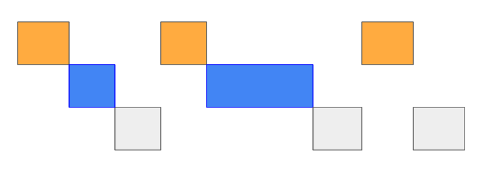
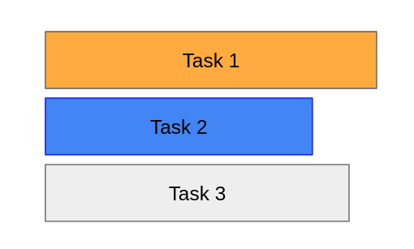

## Mở đầu
- Xử lý đồng thời là khả năng phân chia và điều phối nhiều tác vụ khác nhau trong cùng một khoảng thời gian và tại một thời điểm chỉ có thể xử lý một tác vụ. 
Khái niệm này trái ngược với xử lý tuần tự (sequential processing). Xử lý tuần tự là khả năng xử lý chỉ một tác vụ trong một khoảng thời gian, các tác vụ sẽ được thực thi theo thứ tự hết tác vụ này sẽ thực thi tiếp tác vụ khác.
Tất cả các chương trình đang chạy trong máy tính chúng ta chạy đều do hệ điều hành quản lý, với mỗi chương trình đang chạy như vậy được gọi là một process (tiến trình) và được cấp một process id (PID) để hệ điều hành dễ dàng quản lí. Các tác vụ của tiến trình sẽ được CPU core (nhân CPU) của máy tính xử lý
Nhân CPU sẽ tận dụng thời gian rảnh của tác vụ này để đi làm tác vụ khác, một lúc thì làm tác vụ nhỏ này, một lúc khác thì làm tác vụ nhỏ khác




- Xử lý song song là khả năng xử lý nhiều tác vụ khác nhau trong cùng một thời điểm, các tác vụ này hoàn toàn độc lập với nhau. Xử lý song song chỉ có thể thực hiện trên máy tính có số nhân lớn hơn 1. Thay vì một nhân CPU chúng ta chỉ có thể xử lý một tác vụ nhỏ tại một thời điểm thì khi số nhân CPU có nhiều hơn chúng ta có thể xử lý các tác vụ song song với nhau cùng lúc trên các nhân CPU.


---
## Xử lý đồng thời và song song trong python
### Multithreading
- Khác với các ngôn ngữ lập trình khác, 
trong python, khi sử dụng multithreading thì thực tế các threads 
sẽ được chạy trên cùng một CPU (concurrent) chứ không thực hiện trên các CPU khác nhau (GIL).
- Do đó, khi các threads chạy các jobs yêu cầu nhiều tính toán thì trên thực tế, performance sẽ bị giảm chứ không tăng như ta thường nghĩ khi nói đến multithreading.
- Tuy nhiên, như vậy không có nghĩa là multi-threading là vô dụng. Trên thực tế, multithreading có thể được sử dụng cho tác vụ IO. Vì với tác vụ IO, CPU không cần thực hiện gì cả mà chỉ cần đợi kết quả IO trả về.

```
multithreading thường chỉ được sử dụng để IO
```

### Multiprocessing
- Processing: Dùng để song song hóa các function. Ví dụ, ta có thể chạy nhiều functions trên các CPU khác nhau.
- Pool: Dùng để song song hóa dữ liệu. Ví dụ, ta có thể chạy cùng một function nhưng với các bộ dữ liệu inputs khác nhau.

```
Multiprocessing is best for computations
```
---
## Một số VD

Tính tống từ 1 đến N
- Tính bình thường
- Tính bằng cách sử dung threads
- Tính bằng cách sử dụng process

```python
import multiprocessing
import time
from concurrent.futures.thread import ThreadPoolExecutor
from multiprocessing import Pool, Process
from multiprocessing import Queue
from threading import Thread

import numpy as np

N = 10_000_000
arr = np.random.random(N)
data_threads = []
data_process = Queue()


def xtime(func):
    def run():
        start = time.time()
        func()
        print('time', (time.time() - start))

    return run


def sum_range(args):
    start = args[0]
    end = args[1]
    total = 0
    for i in range(start, end):
        total += arr[i]

    data_process.put(total)
    data_threads.append(total)
    return total


def chunks(n, step):
    for i in range(0, n - step, step):
        yield i, i + step

    yield i + step, n


@xtime
def run_normal():
    total = sum_range([0, N])
    print('run_normal')
    return total


@xtime
def run_process_pool():
    chunks_data = list(chunks(N, int(N / multiprocessing.cpu_count())))
    with Pool(processes=multiprocessing.cpu_count()) as p:
        results = p.map(sum_range, chunks_data)
    print('run_process_pool')


@xtime
def run_process():
    chunks_data = list(chunks(N, int(N / multiprocessing.cpu_count())))
    procs = []
    for item in chunks_data:
        p = Process(target=sum_range, args=(item,))
        p.start()
        procs.append(p)

    for p in procs:
        p.join()

    result = []
    while not data_process.empty():
        result.append(data_process.get())
    print('run_process')


@xtime
def run_threads_pool():
    chunks_data = list(chunks(N, int(N / multiprocessing.cpu_count())))
    with ThreadPoolExecutor(max_workers=multiprocessing.cpu_count()) as executor:
        results = executor.map(sum_range, chunks_data)

    print('run_threads_pool')


@xtime
def run_threads():
    threads = []
    chunks_data = list(chunks(N, int(N / multiprocessing.cpu_count())))
    for item in chunks_data:
        p = Thread(target=sum_range, args=(item,))
        p.start()
        threads.append(p)

    for t in threads:
        t.join()

    print('run_threads')


if __name__ == '__main__':
    run_normal()
    run_threads()
    run_threads_pool()
    run_process()
    run_process_pool()

```

Chạy từng trường hợp
```python
if __name__ == '__main__':
    run_normal()
    run_threads()
    run_threads_pool()
    run_process()
    run_process_pool()


```

Đây thời gian thực thi với N = 10 000 000
```python
# run_normal
# time 0.8122878074645996
# run_threads
# time 0.8335270881652832
# run_threads_pool
# time 0.9215514659881592
# run_process
# time 0.2690088748931885
# run_process_pool
# time 0.27546000480651855
```
